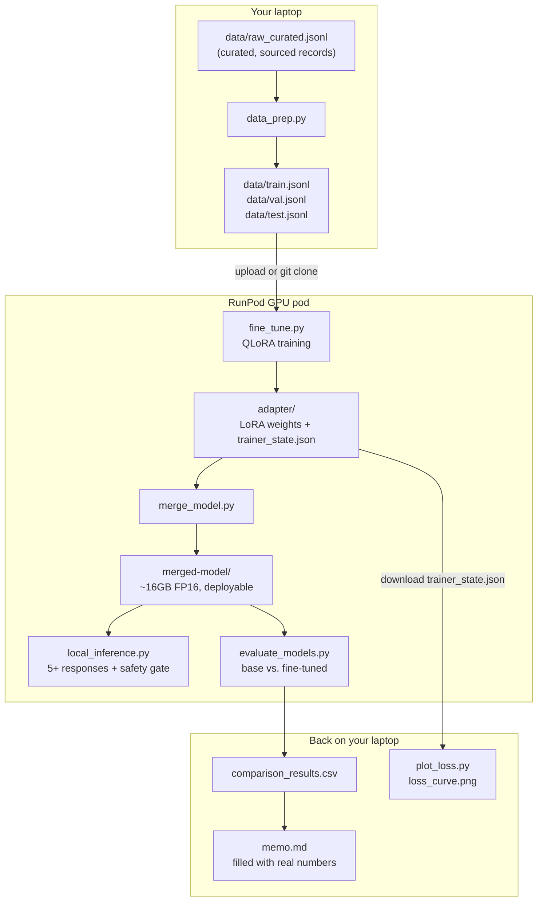
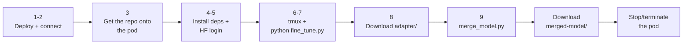

# RunPod Guide — Fine-Tuning BiasharaAssist Step by Step

A detailed, click-by-click walkthrough of running `fine_tune.py` (and then
`merge_model.py`) on a rented RunPod GPU, written for a developer who has
never used RunPod before. If you've already used RunPod, `WORKFLOW.md`'s
Day 2/Day 3 sections are the condensed version of the same steps.

**What RunPod is, in one paragraph:** RunPod rents you a Linux machine
with a real NVIDIA GPU attached, billed per second while it's running. You
deploy a "pod" (their word for a rented instance) from a template that
already has an OS, drivers, and often a deep-learning framework
preinstalled, connect to it over a terminal in your browser (or SSH), run
your code exactly like you would on your own machine, then stop the pod
when you're done so billing stops.

## Why RunPod instead of Nebius

The capstone brief names Nebius specifically for the training deliverable
("fine-tune LLaMA 3.1 8B with QLoRA **on Nebius**", "you are responsible
for your own Nebius credits"). This isn't a convenience substitution:
**Nebius does not support payment from Kenya**, so it was never a usable
option here, independent of preference. RunPod accepts card payment and
covers the exact same technical requirements the brief actually cares
about — a QLoRA fine-tune of LLaMA 3.1 8B, a saved adapter, a loss curve,
a merge, local inference, and an evaluation against the base model. State
this justification explicitly in your README/memo rather than letting the
platform swap pass silently — a grader who sees "RunPod" without
explanation may reasonably wonder whether the brief was read; a grader
who sees "Nebius doesn't support payment from Kenya, so RunPod was used
instead" sees a documented, reasoned decision.

If you *do* have working Nebius credits, everything below still applies
almost unchanged for merge/inference/evaluation (the brief doesn't name a
platform for those three) — only Step 6 onward (the actual training
launch) would move to a Nebius instance instead.

## Architecture



Your laptop only needs a browser, SSH, and Git — it never has to load the
16GB model into memory itself. Everything from training through
evaluation happens on the pod; only the small files (`trainer_state.json`,
`loss_curve.png`, `comparison_results.csv`) need to come back down.

## Before you start

- [ ] A RunPod account (console.runpod.io) with a funded balance — RunPod
      bills from balance, no subscription. Add funds under **Billing**
      before deploying anything.
- [ ] `meta-llama/Meta-Llama-3.1-8B-Instruct` access **approved** on
      Hugging Face (huggingface.co → the model page → request access; this
      can take anywhere from minutes to a day or two, so do this well
      before you plan to train).
- [ ] A Hugging Face **read-scoped** access token (huggingface.co →
      Settings → Access Tokens → New token → role "Read").
- [ ] This repo's `data/train.jsonl` and `data/val.jsonl` already
      generated locally (`python data_prep.py` must have printed
      `VALIDATION PASSED` first — see `CURATION.md`/`WORKFLOW.md` Day 1).
- [ ] `pytest` passes locally (`45 passed, 1 skipped`) — catches a broken
      script *before* you're paying for GPU time to find out, not after.
- [ ] `fine_tune.py` and `merge_model.py` from this repo, ready to upload.

## The steps at a glance



## Step 1 — Deploy the pod

1. Go to **console.runpod.io → Pods → Deploy** (sometimes labelled
   "+ GPU Pod" or "Deploy On-Demand").
2. **Pick a GPU.** You need **Ampere architecture or newer** so the
   training script's `bf16=True` setting works without modification.
   Avoid anything from the RTX 20-series, GTX-anything, or a V100 — those
   are older architectures that don't support bf16 and would need extra
   code changes. The exact GPUs and prices RunPod shows change over time
   and by region/availability; a representative comparison:

   | GPU | Typical price | VRAM | Verdict for this job |
   |---|---|---|---|
   | **A40** | ~$0.40–0.50/hr | 48GB | **Recommended** — cheapest Ampere-class option; this job only peaks around 7–8GB of VRAM, so the extra 40GB is unused headroom rather than wasted spend |
   | RTX 4090 | ~$0.70–0.80/hr | 24GB | Fine — Ada Lovelace architecture, also satisfies the bf16 requirement, just pricier than the A40 here |
   | A100 / H100 | ~$1.50–3/hr | 40–80GB | **Skip for this job** — a LoRA adapter on an 8B model doesn't need this much GPU; you'd be paying several times more for no meaningful speed benefit |

   The dataset here is 159 training examples — this is a small, fast job
   on any of these cards (expect roughly 15–30 minutes of actual training
   time), so the cheapest Ampere-or-newer option is the right call.
3. **Pick a template.** Choose a **prebuilt PyTorch + CUDA** template
   (e.g. "PyTorch 2.x") — not a Stable Diffusion / ComfyUI / media
   generation template, which is for a completely different workload.
   The exact template names and CUDA versions RunPod offers drift over
   time; any "PyTorch" category template is right.
4. **Set disk size to at least 50GB.** The base model's full-precision
   weights are about 16GB on disk (4-bit quantization happens in memory
   at load time, not on disk), and this project's checkpoints are small —
   `fine_tune.py` saves LoRA adapters only (tens of MB each, `save_total_
   limit=3`), not full 16GB model snapshots per checkpoint, so 50GB is a
   realistic minimum. If you'd rather not think about it again, **80–100GB
   gives comfortable headroom** for the base model's Hugging Face cache
   and the ~16GB merged model to coexist on disk at once (Step 9)
   without you needing to clean anything up in between.
5. Click **Deploy**, then wait for the pod's status to show **Running**.
   **Billing starts the moment it shows Running**, whether or not you've
   run anything yet.

## Step 2 — Connect to the pod

RunPod's **Connect** panel on your pod offers a few routes. In order of
how easy they are for a first-timer:

- **Web Terminal (easiest)** — toggle "Enable Web Terminal" in the
  Connect panel; it opens a terminal directly in your browser, no key
  setup required. Use this if you just want to get started.
- **Jupyter Notebook** — the panel gives you an HTTP link (usually on
  port 8888) to a browser-based Jupyter Lab. This also has a **Terminal**
  tab under "Other" in its Launcher screen, plus a working file-upload
  button in its file browser — useful if you'd rather drag-and-drop files
  than use `scp` (see Step 3).
- **SSH** — the panel shows an `ssh` command. First time, generate a key
  pair and paste the public half into the panel's SSH key box:

  ```powershell
  ssh-keygen -t ed25519 -C "you@example.com"
  Get-Content "$env:USERPROFILE\.ssh\id_ed25519.pub"
  ```

  Then connect with the exact command the panel shows you (it's specific
  to your pod). Note: RunPod's proxy SSH route (`ssh.runpod.io`) is
  interactive-only — no `scp`/`sftp` support, fine for typing commands by
  hand but not for transferring files. If the panel also offers a direct
  TCP SSH option (a raw IP and port), that one usually does support
  `scp` — test it first with
  `ssh -o ConnectTimeout=10 root@<ip> -p <port> -i ~/.ssh/id_ed25519 echo ok`
  before relying on it; not every pod/GPU tier exposes it.
- **VS Code Remote-SSH** — if you're already comfortable with it, point
  VS Code's Remote-SSH extension at the same SSH command the panel gives
  you. This gets you a real editor and integrated terminal on the pod at
  once, but it's an extra layer of setup — skip it your first time
  through and use the Web Terminal instead.

All routes land you in a real Linux shell — everything below works
identically no matter which one you picked.

## Step 3 — Get the repo onto the pod

The training script expects `data/train.jsonl` and `data/val.jsonl`
inside a `data/` folder next to `fine_tune.py`.

**Fastest — clone directly from GitHub, if you've already pushed this
repo there:**

```bash
git clone https://github.com/YOUR_USERNAME/YOUR_REPO.git
cd YOUR_REPO
```

This pulls `fine_tune.py`, `merge_model.py`, and `data/train.jsonl`/
`val.jsonl` in one step — no manual file selection. `.env` is gitignored
and never gets cloned, which is correct: you'll `export HF_TOKEN=...`
directly on the pod in Step 5, not copy a secrets file onto a rented
machine you don't control long-term.

**If the repo isn't pushed yet, or you'd rather not clone it — the
Jupyter file browser:**
1. Open the port-8888 Jupyter link from the Connect panel.
2. In the left file-browser panel (starts at `/workspace/`), click
   **New Folder**, name it `data`.
3. Double-click into `data/`, click the **Upload** (↑) icon, and select
   your local `data/train.jsonl` and `data/val.jsonl`.
4. Navigate back to `/workspace/`, click **Upload** again, add
   `fine_tune.py` — next to `data/`, not inside it.
5. Under **Other** in the Launcher, open a **Terminal** tab (not
   **Notebook** — that runs Python through a kernel, not a shell) for
   every command from here on.

**If direct-TCP SSH tested successfully in Step 2:**

```powershell
scp -i "$env:USERPROFILE\.ssh\id_ed25519" -P <port> `
    data\train.jsonl data\val.jsonl fine_tune.py root@<ip>:~/
# then, on the pod: mkdir -p data && mv train.jsonl val.jsonl data/
```

Verify before moving on:

```bash
ls -lh data/
wc -l data/train.jsonl   # expect 159
```

## Step 4 — Install dependencies on the pod

Run this exact command. The version pins matter more than they look like
they should — see the Troubleshooting section below for what breaks if
you skip or loosen them:

```bash
pip install "transformers==4.43.3" "trl==0.8.6" "peft==0.11.1" \
    "bitsandbytes>=0.46.1" "accelerate==0.33.0" \
    datasets huggingface_hub rich hf_transfer
```

Don't install `torch` — the pod's template already ships a CUDA-matched
build; installing one from PyPI on top of it risks replacing it with a
CPU-only or mismatched-CUDA wheel, which breaks `bitsandbytes` in a
confusing way.

**Confirm the GPU is actually visible before going further:**

```bash
nvidia-smi
python -c "import torch; print(torch.cuda.is_available()); print(torch.cuda.get_device_name(0))"
```

You want to see your GPU listed in the `nvidia-smi` table, and `True`
followed by the GPU's name (e.g. `NVIDIA GeForce RTX 4090`) from the
Python check. If `torch.cuda.is_available()` prints `False`, don't
proceed to training — it means `torch` can't see the GPU at all (most
often a template mismatch), and `fine_tune.py` would either crash or
silently fall back to a CPU run that would take hours instead of minutes.

## Step 5 — Authenticate with Hugging Face

```bash
export HF_TOKEN=hf_your_real_token_here
huggingface-cli login --token $HF_TOKEN
```

If this fails, double-check your Llama 3.1 access request actually shows
**Approved** (not "Pending") on the model's Hugging Face page — a
Read-scoped token with a still-pending request will fail to download the
gated weights with a 403, which looks similar to an auth failure but has
a different fix (wait for approval, don't regenerate the token).

## Step 6 — Launch training inside `tmux`

`tmux` keeps the training process running even if your browser tab closes
or your connection drops — without it, a dropped connection kills the
job halfway through. Not every RunPod template ships `tmux` preinstalled
— check first:

```bash
which tmux || (apt update && apt install -y tmux)
```

Then launch training inside it:

```bash
tmux new -s finetune
python fine_tune.py
```

To detach (leave it running in the background): press **Ctrl-b**, then
**d**. To check back in later:

```bash
tmux attach -t finetune
```

## Step 7 — Watch it train

**In a second terminal/SSH session** (so it doesn't interrupt the `tmux`
session running training), you can watch GPU memory fill up in real time:

```bash
watch -n 1 nvidia-smi
```

For this job (an 8B model in 4-bit plus a small LoRA adapter), expect GPU
memory usage somewhere around 7–10GB out of your card's total — nowhere
close to maxing out a 24GB card, which is exactly why the A40/RTX 4090
recommendation in Step 1 has comfortable headroom.

`fine_tune.py` prints `loss` (training fit) and, every 10 steps,
`eval_loss` (validation fit) too. What healthy looks like: both numbers
fall together over the run. Two patterns worth stopping early for instead
of waiting out the full run:

- **`eval_loss` stalls or rises while `loss` keeps falling** — the model
  is starting to overfit (memorizing training examples rather than
  learning the general pattern).
- **Neither number moves much at all after several logging steps** — the
  model isn't learning; check that `data/train.jsonl` actually has
  content and that the learning rate wasn't accidentally set near zero.

A healthy run on this dataset size (159 examples, 3 epochs) typically
takes on the order of 15–30 optimizer steps total and 15–30 minutes of
wall-clock time on an A40 or RTX 4090.

## Step 8 — Download the adapter, then stop the pod

When `trainer.train()` finishes, `fine_tune.py` writes the final adapter
to `adapter/` (adapter weights, tokenizer files, and
`trainer_state.json` — the loss history you'll plot locally).

1. Download the whole `adapter/` folder — via the Jupyter file browser
   (right-click → Download, or select and use the download toolbar
   button) or `scp` if that route worked for you in Step 2.
2. **Stop or terminate the pod immediately once the download finishes.**
   RunPod bills per second while a pod shows **Running**, whether or not
   a job is actively using the GPU. **Stop** keeps your disk (and
   anything not yet downloaded) for a later restart at a lower idle rate;
   **Terminate** deletes the pod and its disk entirely and stops all
   billing, including storage.

Back on your own machine:

```bash
python plot_loss.py --trainer-state adapter/trainer_state.json
```

## Step 9 — Merge the adapter (same pod, before you stop it)

Do this **before** Step 8's stop/terminate — merging needs the
full-size base model loaded into memory, which is easiest to do on the
same GPU pod rather than downloading another 16GB locally.

```bash
python merge_model.py
```

This writes `merged-model/` — the deployable, adapter-free model. Download
that folder too (it's the larger of the two, budget more transfer time),
*then* stop/terminate the pod.

## Troubleshooting — errors you may actually hit

These are real errors that show up when running this exact script on a
RunPod PyTorch template, not hypothetical ones — if you hit one of these,
this is the fix, not a sign something is fundamentally wrong with your
setup.

| Error (key phrase) | Why it happens | Fix |
|---|---|---|
| `ModuleNotFoundError: No module named 'rich'` | `trl==0.8.6` uses `rich` for console output internally, but installing `trl` doesn't automatically pull it in | `pip install rich` |
| `ValueError: Fast download using 'hf_transfer' is enabled ... but 'hf_transfer' package is not available` | RunPod's template presets an environment variable for faster downloads but doesn't preinstall the package that implements it | `pip install hf_transfer` |
| `ValueError: rope_scaling must be a dictionary with two fields, type and factor, got {...'rope_type': 'llama3'}` | An older `transformers` version predates Llama 3.1's rope-scaling config format | Make sure you installed the exact pin from Step 4 (`transformers==4.43.3`), not an older or newer one |
| `TypeError: Trainer.__init__() got an unexpected keyword argument 'tokenizer'` | Happens if `transformers` got upgraded past the pin (e.g. via an unrelated `pip install -U` run) — a newer release removed the `tokenizer=` argument `trl==0.8.6`'s trainer still uses | Reinstall the exact pinned `transformers==4.43.3` from Step 4 |
| `Could not find the bitsandbytes CUDA binary` / `ModuleNotFoundError: No module named 'triton.ops'` | An older `bitsandbytes` has no prebuilt binary for the pod's CUDA version | `pip install "bitsandbytes>=0.46.1"` — keep `transformers` at its pin; only `bitsandbytes` needs to be newer |
| `ValueError: .to is not supported for 4-bit or 8-bit bitsandbytes models` | An unpinned `accelerate` resolved to a version whose device-placement code conflicts with a 4-bit quantized model | `pip install "accelerate==0.33.0"` exactly, from Step 4 |
| SSH proxy route refuses `scp` / pipes / non-interactive commands | RunPod's proxy SSH endpoint (`ssh.runpod.io`) is interactive-only by design, no file-transfer support | Use the Jupyter file browser (Step 3) or the direct-TCP SSH endpoint instead, if your pod exposes one |

**The general lesson if you hit something not in this table:** an
open-ended `pip install -U <package>` has no ceiling and can silently
drift to a version released long after this script (or its pinned
`trl`/`peft` dependencies) was written, cascading into further
incompatible-version errors. Prefer reinstalling the exact pin from Step
4 over an unbounded upgrade — if that still fails, the error message
itself (not another blind upgrade) is the next thing to search on.

## Self-check before you call it done

- [ ] GPU was Ampere-or-newer (A40, RTX 4090/3090, A100, or better)
- [ ] All five pinned packages from Step 4 installed without error
- [ ] `wc -l data/train.jsonl` printed 159 before launching
- [ ] Training ran inside `tmux`, not a bare foreground process
- [ ] `loss` and `eval_loss` both fell over the course of the run
- [ ] `adapter/` (with `trainer_state.json`) downloaded locally
- [ ] `merged-model/` produced by `merge_model.py` and downloaded, before
      stopping the pod
- [ ] Pod stopped or terminated — check the RunPod console directly to
      confirm, don't just assume the browser tab closing did it

## Cost expectations

This is a small job — 159 training examples, an 8B model in 4-bit, LoRA
only (not full fine-tuning). On a ~$0.40–0.50/hr card, expect the whole
Steps 1–9 sequence (deploy, setup, train, merge, download, stop) to cost
well under $1 in GPU time if you move through the steps without long idle
gaps. The real cost driver is forgetting to stop the pod — an idle
**Running** pod bills the same per-second rate as one actively training,
so the single most important habit here is stopping it the moment you've
downloaded what you need.
