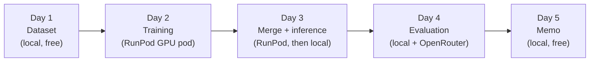

# Workflow — Building BiasharaAssist Start to Finish

This is the day-by-day runbook for this capstone: the order tasks actually
happen in, which machine each step runs on, the exact commands, and what
"done" looks like before moving to the next day. `README.md` covers *how
to reproduce* the finished repo in one pass; this file covers *how it gets
built*, session by session, including the stop points where you check a
result before spending money or time on the next step.

Each day below corresponds to one milestone. Don't start a day until the
previous one's "Done when" checklist is fully true — a broken dataset or a
bad merge wastes GPU money if you find out about it two steps later
instead of immediately.



**A note on Day 2's platform:** the capstone brief names Nebius
specifically for training. This project uses RunPod instead because
Nebius does not support payment from Kenya — a documented compute-access
constraint, not a convenience swap. See `RUNPOD_GUIDE.md`'s "Why RunPod
instead of Nebius" section for the full reasoning, and state this
explicitly in your own README/memo rather than letting the platform
choice go unexplained.

## Before Day 1 — one-time setup

- [ ] Python 3.10+ installed locally, `python -m venv .venv` created and
      activated.
- [ ] `pip install -r requirements.txt` (no `torch` pin — see the comment
      at the top of that file for why; install `torch` separately for
      your platform before Day 3/4 — both `local_inference.py` and
      `evaluate_models.py` need it and will fail with
      `ModuleNotFoundError: No module named 'torch'` without it).
- [ ] Hugging Face account created, and access requested at
      `huggingface.co/meta-llama/Meta-Llama-3.1-8B-Instruct` (Meta gates
      this model; approval can take anywhere from minutes to a day or two
      — request it *before* Day 2, not on the day you want to train).
- [ ] Once approved: a read-scoped HF access token from
      **huggingface.co → Settings → Access Tokens**.
- [ ] A RunPod account with a funded balance (RunPod bills per-second from
      balance, no subscription).
- [ ] An OpenRouter account and API key at `openrouter.ai/keys` (for the
      LLM-judge half of evaluation).
- [ ] `cp .env.example .env`, fill in `HF_TOKEN` and `JUDGE_API_KEY`. Never
      commit the real `.env` — it's gitignored.

## Day 1 — Dataset (Deliverable 1)

**Runs locally. No GPU, no spend.**

1. Curate `data/raw_curated.jsonl` one record at a time, following
   `CURATION.md`'s sourcing rules exactly: fetch the real official page,
   read it, write the record, set `verified: true` only after checking
   the response against the source. Don't batch this — verifying ten
   records against memory instead of the page in front of you is how
   wrong facts get in.
2. Validate and split:

   ```bash
   python data_prep.py
   ```

3. Read `validation_report.md`. If it reports errors, fix the specific
   flagged records — don't loosen the validation gate to make them pass.
4. Once it's clean, write or update the curation note at the bottom of
   `CURATION.md`: how records were sourced, what quality/safety checks
   were applied, and what coverage gaps remain. This note is graded
   alongside the dataset itself, not as an afterthought.

**Done when:** `python data_prep.py` prints
`VALIDATION PASSED: <n> record(s), zero errors.` with `<n>` ≥ 100,
`data/train.jsonl` / `val.jsonl` / `test.jsonl` exist in an
80/10/10-ish split, and the curation note is written.

## Day 2 — Training (Deliverable 2)

**Runs on a RunPod GPU pod. This is the only day that costs real money —
budget roughly one focused session, not a multi-day background job.** If
this is your first time using RunPod, see `RUNPOD_GUIDE.md` for the
click-by-click version of every step below, including a troubleshooting
table for the exact errors this pinned dependency set can hit.

1. **Deploy the pod.** console.runpod.io → Pods → Deploy. Pick an
   **Ampere-or-newer** GPU (an A40 or RTX 4090 is plenty for an 8B LoRA
   run — skip the H100, it's several times the price for no benefit on a
   job this size) and a prebuilt **PyTorch + CUDA** template, at least
   50GB disk. Wait for **Running** — billing starts here.
2. **Connect** via the console's Web Terminal (fastest, no key setup) or
   SSH.
3. **Upload the data and script.** Create a `data/` folder on the pod and
   upload `data/train.jsonl` and `data/val.jsonl` into it, then upload
   `fine_tune.py` next to (not inside) `data/`. Confirm with
   `wc -l data/train.jsonl` before proceeding.
4. **Install dependencies on the pod:**

   ```bash
   pip install "transformers==4.43.3" "trl==0.8.6" "peft==0.11.1" \
       "bitsandbytes>=0.46.1" "accelerate==0.33.0" \
       datasets huggingface_hub rich hf_transfer
   ```

   These exact pins matter more than they look like they should — an
   open-ended `pip install -U transformers` or a missing `rich`/
   `hf_transfer` are the two most common ways this step breaks. If you
   hit `ModuleNotFoundError` for either, install it individually; if you
   hit a `rope_scaling` `ValueError`, it means `transformers` resolved to
   a version older than the pin above — reinstall with the exact pin, not
   an unbounded upgrade.
5. **Authenticate and launch inside `tmux`** so the run survives a
   dropped connection:

   ```bash
   export HF_TOKEN=hf_your_token_here
   huggingface-cli login --token $HF_TOKEN
   tmux new -s finetune
   python fine_tune.py
   # detach: Ctrl-b then d   |   reattach: tmux attach -t finetune
   ```

6. **Watch it converge**, don't just let it run unattended — every 10
   steps `fine_tune.py` logs both `loss` (training fit) and `eval_loss`
   (validation fit). Both should fall together; if `eval_loss` stalls or
   rises while `loss` keeps falling, that's overfitting starting in real
   time and worth stopping early to reconsider LoRA rank or epochs rather
   than finishing the full run.
7. **Download the adapter** (`adapter/`, via the Jupyter file browser or
   `scp`), then **stop or terminate the pod immediately** — RunPod bills
   per-second while Running, active job or not.
8. **Plot and diagnose**, locally:

   ```bash
   python plot_loss.py --trainer-state adapter/trainer_state.json
   ```

   Write your own healthy/overfit/underfit call in the training writeup —
   the script's printed heuristic is a starting point, not the graded
   diagnosis.

**Done when:** `adapter/` (adapter weights + `trainer_state.json`) is
downloaded locally, `loss_curve.png` is generated, you've written a
one-paragraph healthy/overfit/underfit diagnosis, and the pod is stopped.

## Day 3 — Merge and local inference (Deliverable 3)

**`merge_model.py` runs on the pod (before you terminate it — it needs
the full-size base model in memory); `local_inference.py` runs locally
against the downloaded merged model.**

1. On the pod, with `adapter/` still present:

   ```bash
   python merge_model.py
   ```

2. Download `merged-model/` to your local machine (this is the ~16GB
   deployable model — expect the transfer to take a while).
3. Terminate the pod now; nothing past this point needs a GPU rental.
4. Locally:

   ```bash
   python local_inference.py
   ```

   This prints five sample responses (one per curated dataset area, plus
   one deliberate guarantee-seeking question to confirm the model
   correctly refuses to promise an outcome) and runs the verification
   gate: every response must contain the exact BiasharaAssist disclaimer
   and must not contain an outcome-promising phrase. Read the actual
   responses, not just the PASS/FAIL line — "passes the keyword check"
   and "is actually a good answer" are different things.

**Done when:** `local_inference.py` prints five relevant, on-topic
responses, all five pass the verification gate, and the stability check
(`identical output on repeat query`) passes.

## Day 4 — Evaluation (Deliverable 4)

**Runs locally, against both the base model and `merged-model/`. This
step also spends a small amount on OpenRouter API calls (20 questions ×
2 models × 1 judge call each = 40 calls at `openai/gpt-4o-mini` pricing —
a few cents, not a budgeting concern like Day 2's GPU rental.)**

```bash
python evaluate_models.py
```

This downloads the base model (needs `HF_TOKEN` — it's gated too), loads
`merged-model/`, runs both against all 20 questions in `data/test.jsonl`,
scores every response on ROUGE-L, token F1, and the four-dimension LLM
judge (correctness, groundedness, relevance, helpfulness), and flags any
fine-tuned response scoring below the groundedness floor as a compliance
alert.

**Done when:** `comparison_results.csv` exists with all 20 rows, the
printed comparison table shows base vs. fine-tuned averages for ROUGE-L /
judge score / groundedness, and you've read the printed top-3/bottom-3
breakdown and written down *why* those specific questions improved most
and least — that explanation is the graded part, not just running the
script.

## Day 5 — Memo (Deliverable 5)

**No compute. Just writing, from real numbers.**

Fill every `{{PLACEHOLDER}}` in `memo.md` directly from
`comparison_results.csv` and the Day 2 training run — never estimate or
round a number that isn't actually in those files. One page maximum:
what was built (jargon-free), the quality improvement in percentages,
the compute cost (GPU type × hours × RunPod's hourly rate for that pod),
two next actions with a business rationale each, and one risk with its
mitigation.

**Done when:** every placeholder is a real number or sentence, the memo
fits on one page, and every claim in it can be traced back to a specific
cell in `comparison_results.csv` or the training run.

## If you need to stop and resume mid-project

Each day's "Done when" checklist is the resume point — check `README.md`'s
project-status table for which milestone is last complete, confirm its
artifacts exist (`validation_report.md`, `adapter/trainer_state.json`,
`merged-model/`, `comparison_results.csv`, as appropriate), and start the
next day fresh rather than assuming an in-progress step finished cleanly.
